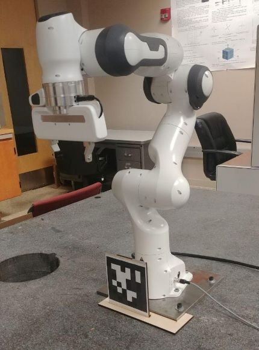

# AprilTag Distance Calculator: Using D435i RealSense

Calculate the distance between a reference AprilTag and additional AprilTags with a RealSense D435i depth camera. Output values referencing a defined AprilTag ID as the origin and track multiple AprilTags based on those coordinates.

Built with the a base of an open source [AprilTags C++ library](https://people.csail.mit.edu/kaess/apriltags/) and a reference to [Intel® RealSense™ SDK 2.0](https://github.com/IntelRealSense/librealsense), a hybrid distance calculator was made to reduce the startup costs of manually programming access to video streams, identify Apriltags while using the librealsense C++ API, and dynamically find the distance between tags with an [OpenCV](https://opencv.org/) display.

## Features

The main function of this program is to detect [AprilTags](https://github.com/AprilRobotics/apriltag) and print out the distances relative to an origin. Below is the main code segment where the distance is printed relative to the vectors originating from the camera in meters. This occurs only if the tags are detected in time. Otherwise, it brings up an error of lacking a reference tag where it defaults to the last known values or erases the entire string of a normal tag.

```c++
        map<int, int>::iterator it;
        for ( it = lru.begin(); it != lru.end(); it++){
            int key = it->first;  // string (key)
            int value = it->second;

            if(value < 0){ // Didn't get detected "in time", so it must be gone
                if(key == referenceTagId){
                    if(lastCount == 0){
                        cout << "Reference tag is out of sight, falling back on last known value." << endl;
                    }
                } else {
                    lru.erase(it);
                    outputStrings.erase(key);
                }
            } else { // Still detected. Continue as normal and print difference in vector distance in meters
                if(lastCount == 0){ 
                    Eigen::Vector3d newPosition = vectorsFromCamera[key] - vectorsFromCamera[referenceTagId];

                    cout << "Id: " << key
                    << ", distance=" << newPosition.norm()
                    << "m, x=" << newPosition(0)
                    << ", y=" << newPosition(1)
                    << ", z=" << newPosition(2) << endl;
                }
                lru[key] = value - 1;
            }
        }
```

This structure can be seen best below as the tags are moved across the RealSense's field of view. The highlighted red circles define the center of a detected AprilTag. As the tags move out of view, the program delays by a defined variable before confirming the tags are missing to reduce small hiccups of missing information and smooth out the data. More detailed comments are in the program. 


## Installation

### Requirements

* Linux (Ubuntu 12.04 and above) 
* Mac OS X (10.8.2 and above) 
* Windows not officially supported, but might work
* Download and install the [AprilTags C++ Library](https://people.csail.mit.edu/kaess/apriltags/) 
* Download and install [Intel® RealSense™ SDK 2.0](https://github.com/IntelRealSense/librealsense)
* RealSense Depth Camera (D435i or family type)
* C++

### Setup

Due to issues separating the make file when the previous author used a pods build system in connection with cmake and getting the correct dependencies, the code currently must run in the /apriltags/demo folder of the AprilTags C++ Library. It only references a few key components and should be able to be implemented elsewhere shortly. Within the setup, the [CMakeLists.txt](https://bitbucket.org/kaess/apriltags/src/master/example/CMakeLists.txt) file must be edited to include:
```
cmake_minimum_required (VERSION 2.6)

link_libraries(apriltags)
link_libraries(realsense2)

add_executable(apriltags_demo apriltags_demo.cpp Serial.cpp)
pods_install_executables(apriltags_demo)

add_executable(realsense_apriltag realsense_apriltag.cpp Serial.cpp)
pods_install_executables(realsense_apriltag)

add_executable(imu imu.cpp Serial.cpp)
pods_install_executables(imu)

```
Now it should be ready to run following the AprilTag C++ Library instructions.

## Usage

The program was designed to assist in the movement of a [Franka Emika Panda Robot](https://www.franka.de/technology). By attaching an AprilTag in a known location from the base, or the reference tag, the goal is to manually input the distance to the true base the robot recognizes. From here, the Panda can predict the distance to the end effector relative to its surroundings and objects attached to AprilTags.

Franka Emika in Lab        |  RealSense AprilTag Demo
:-------------------------:|:-------------------------:
             |  

In terms of accuracy, it tends to be within a centimeter or less and outputs in meters. The precision is similarly high and should reliably grip objects within the tolerance window of the Panda’s end effector.

## Future Improvements

True use of depth with point cloud and other features unique to RealSense would be the logical next step. Since the library has been implemented in this version, it should be relatively straight forward to use the API to sync separate pipeline streams into the program. It could be aligned to perform checks relative to the RGB camera used to detect the AprilTags. Yaw, pitch, and roll are also calculated in this program. While not printed since they are relative to the camera, they could be used to identify more specific translation in space besides the X, Y, and Z coordinates.

