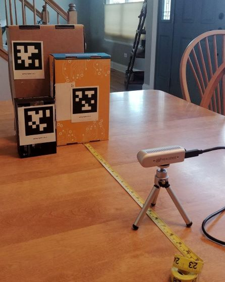

# AprilTag Distance Calculator: Using D435i RealSense
Calculate the distance between a reference AprilTag and additional AprilTags with a RealSense D435i depth camera. Output values referencing a defined AprilTag ID as the origin and track multiple AprilTags based on those coordinates.

Built with the a base of an open source [AprilTags C++ library](https://people.csail.mit.edu/kaess/apriltags/) and a reference to [Intel® RealSense™ SDK 2.0](https://github.com/IntelRealSense/librealsense), a hybrid distance calculator was made to reduce the startup costs of manually opening video streams, identify Apriltags while using the librealsense C++ API, and dynamically find the distance between tags with an [OpenCV](https://opencv.org/) display.

## Features

## Installation

### Requirements

## Usage

### Command-Line Interface & OpenCV

### Use Case

## Future Improvements

You can use one `#` all the way up to `######` six for different heading sizes.

If you'd like to quote someone, use the > character before the line:

> Coffee. The finest organic suspension ever devised... I beat the Borg with it.
> - Captain Janeway

I think you should use an
`<Add in here>` element here instead.

    function fancyAlert(arg) {
      if(arg) {
        $.facebox({div:'#foo'})
      }
    }

